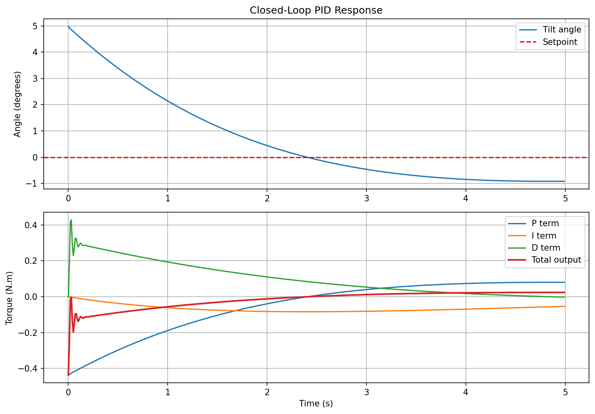
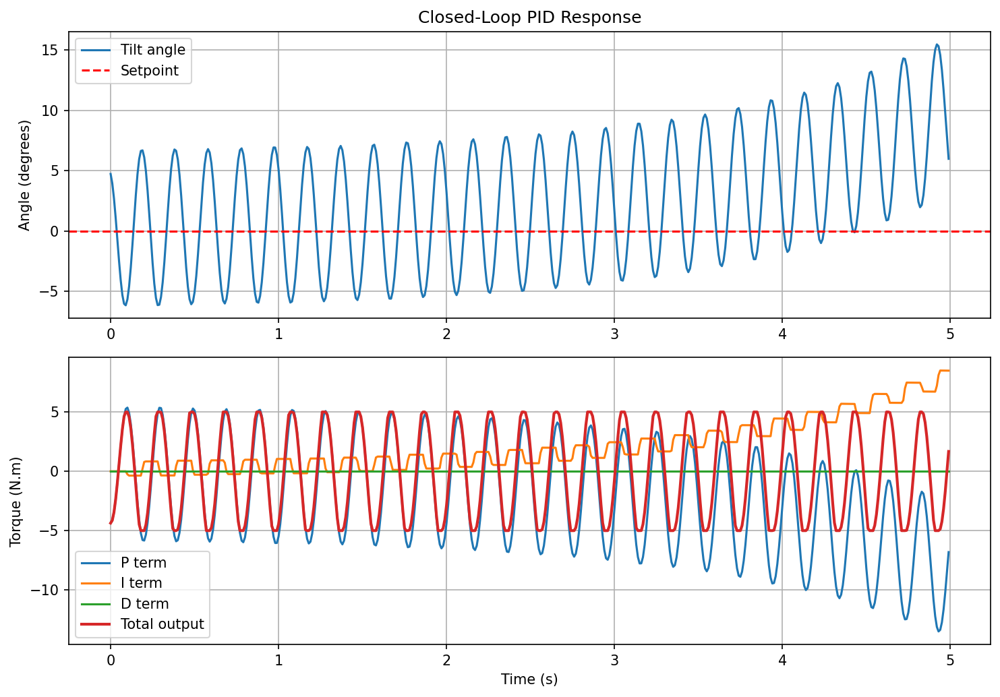

# Self-Balancing Robot — PID Control Project

A two-wheel self-balancing robot built from scratch, using PID control and an IMU for feedback.

## Project Stages

-  **Stage 0** — Simulation of a single body pendulum: PID control, gain tuning, documented results
-  **Stage 1** — Full coupled simulation of a Cart-pole model: derive equations, position and angle control
-  **Stage 2** — Hardware design: Component selection, mechanical design, CAD, motor characterisation
-  **Stage 3** — Embedded implementation: Microcontroller, IMU integration, sensor filtering, PID on hardware
-  **Stage 4** — Testing and validation: Comparing hardware performance against simulation, tuning on real system

## Skills Demonstrated

- Dynamic modelling and equations of motion from first principles
- PID control design with anti-windup and derivative on measurement
- Discrete-time simulation in Python
- Gain tuning and performance analysis
- Engineering documentation

## Results - Stage 0 


*Nominal tuning — stable convergence within 0.5 seconds*



*Low Kp — persistent steady state error due to weak proportional correction*



*No derivative term — unstable oscillation with growing amplitude*

## Setup
```
pip install -r requirements.txt
```