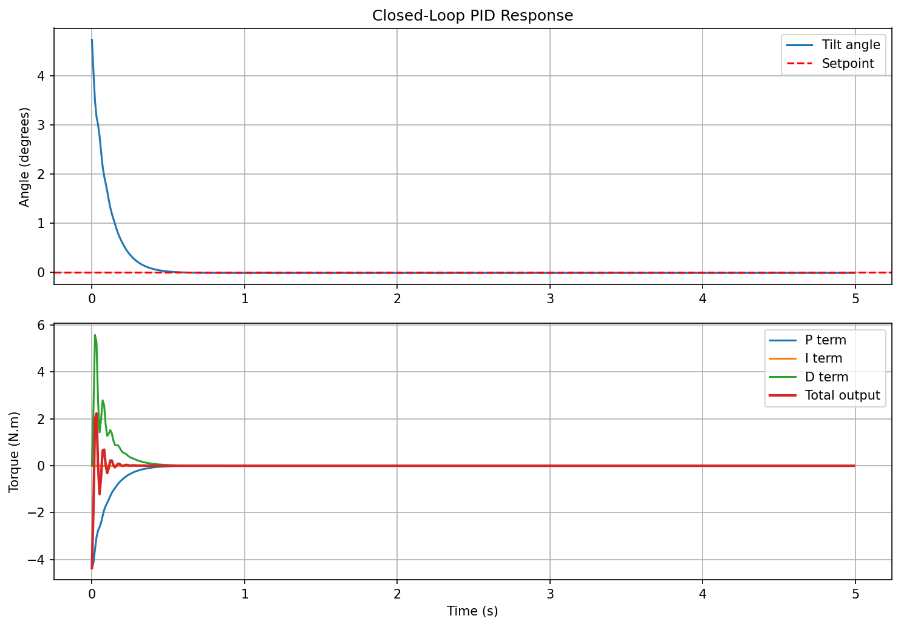
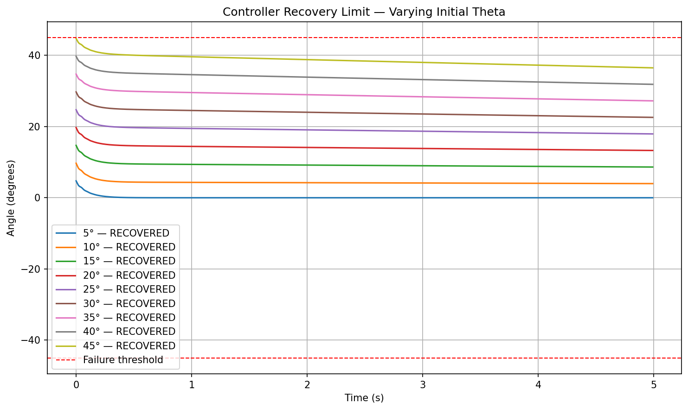
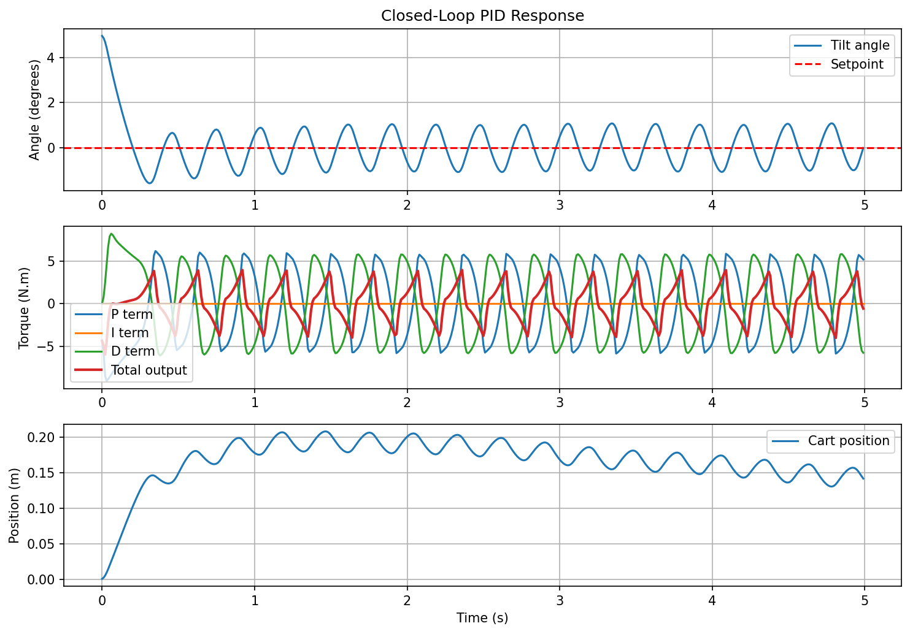
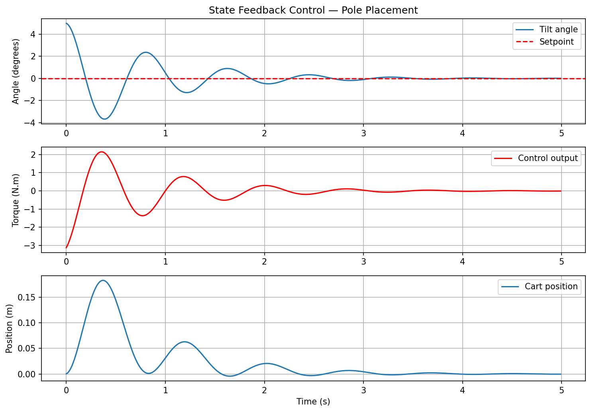

# Self-Balancing Robot — PID Control Project

A two-wheel self-balancing robot built from scratch, using PID control and an IMU for feedback.

## Project Stages

-  **Stage 0** — Simulation of a single body pendulum: PID control, gain tuning, documented results
- **Stage 1** — Full coupled cart-pole simulation: explicit equations of motion, cascaded PID, pole placement analysis, state feedback control 
-  **Stage 2** — Hardware design: Component selection, mechanical design, CAD, motor characterisation
-  **Stage 3** — Embedded implementation: Microcontroller, IMU integration, sensor filtering, PID on hardware
-  **Stage 4** — Testing and validation: Comparing hardware performance against simulation, tuning on real system

## Skills Demonstrated

- Dynamic modelling and equations of motion from first principles
- PID control design with anti-windup and derivative on measurement
- Discrete-time simulation in Python
- Gain tuning and performance analysis
- Engineering documentation

## Results - Stage 0 

*Nominal tuning — stable convergence within 0.5 seconds*

<br>

*Controller recovery limit — 5 N.m torque limit, all angles recovered but only up to 10° converge to zero*



[View full Stage 0 results](docs/results/stage0/README.md)

## Results — Stage 1

*Cascaded PID — oscillates, does not fully converge*

<br>

*State feedback with pole placement — converges to zero*



[View full Stage 1 results](docs/results/stage1/README.md)

## Setup
```
pip install -r requirements.txt
```