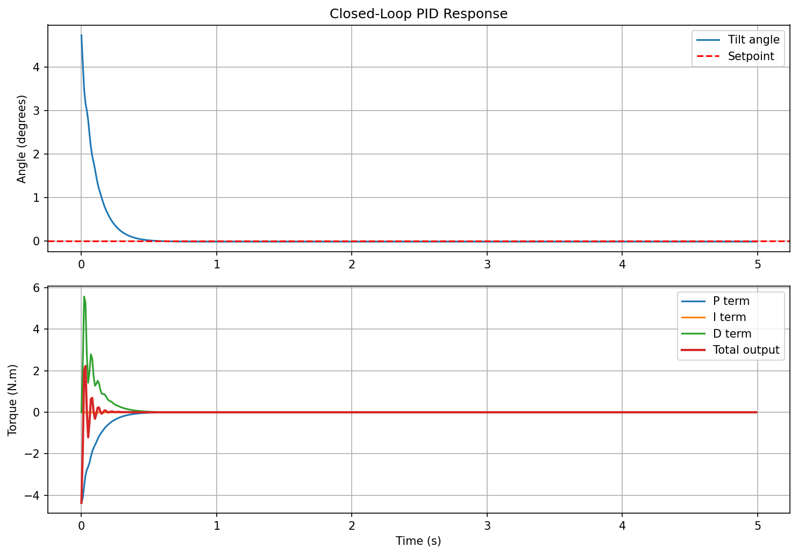
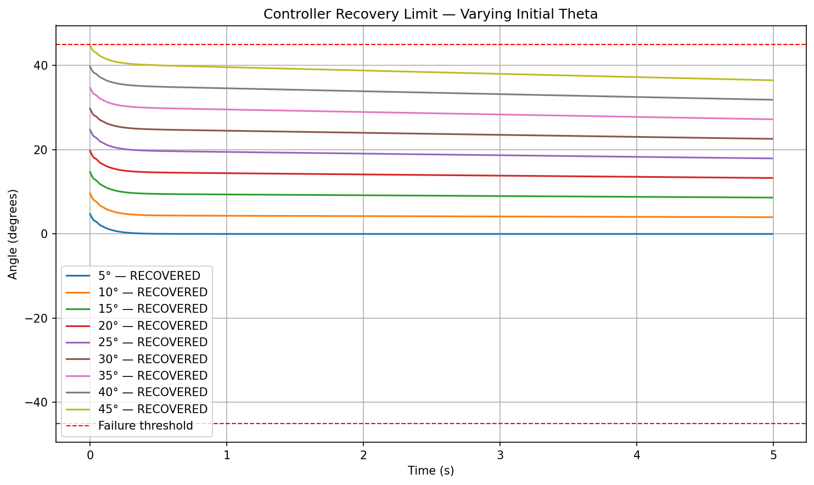
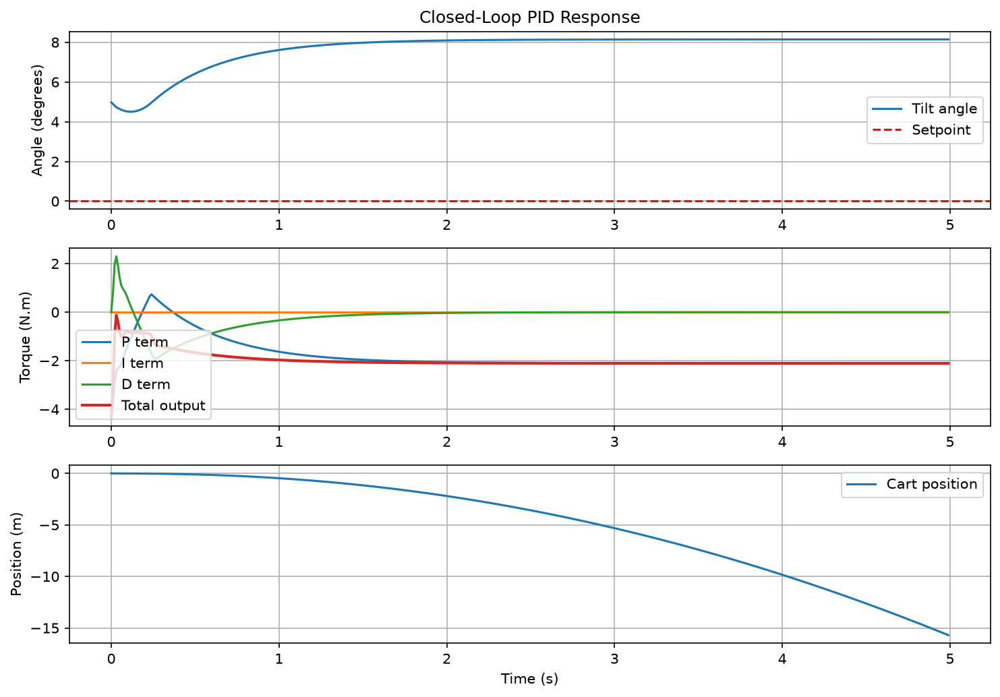
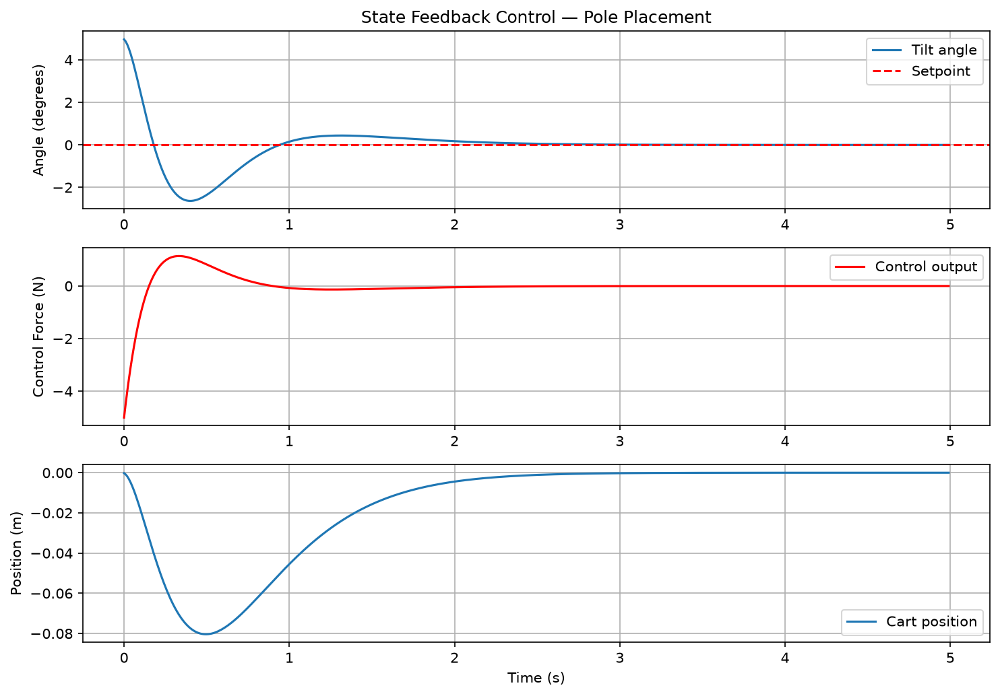
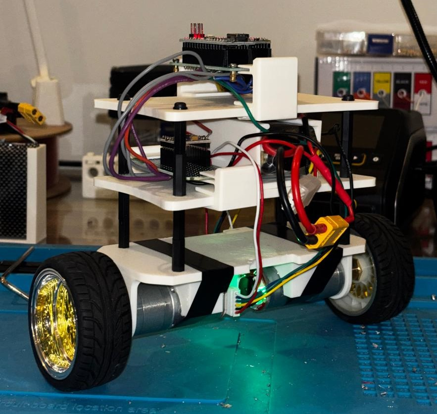
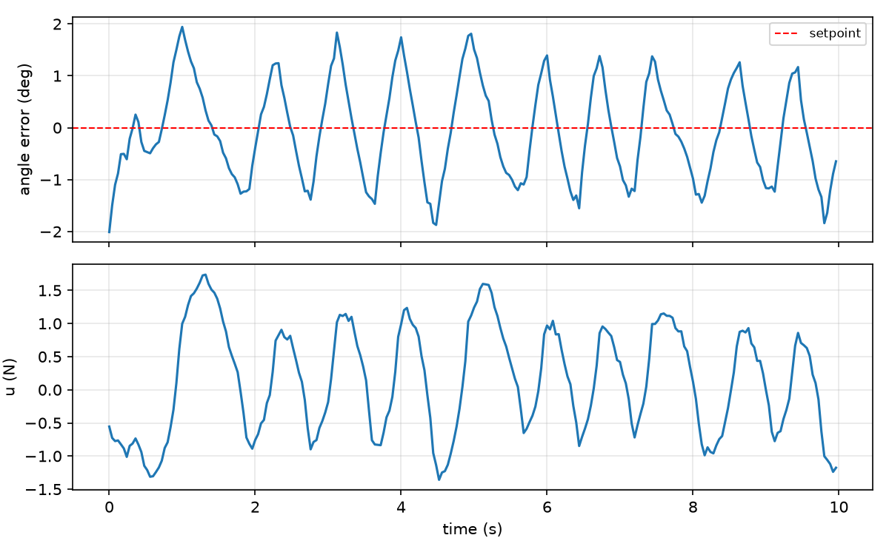
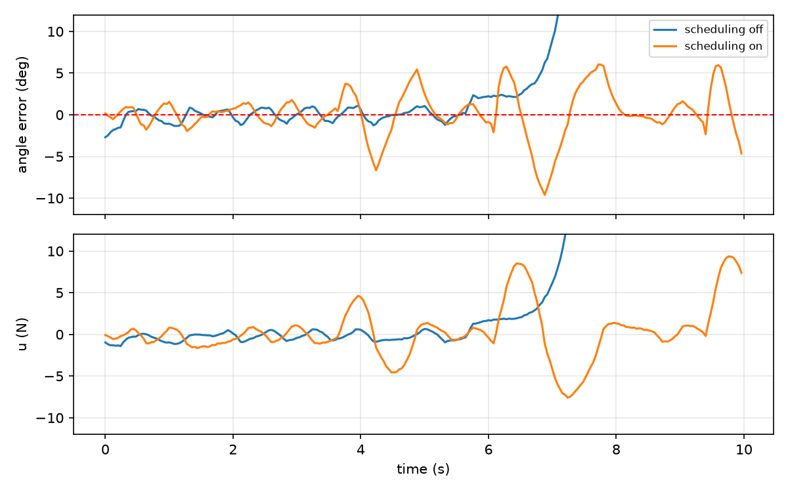

# Self-Balancing Robot - Control Systems Project

A two-wheel self-balancing robot built from scratch — from first-principles dynamic
modelling and simulation to embedded control on hardware.

## Project Stages

-  **Stage 0** - Simulation of a single body pendulum: PID control, gain tuning, documented results
- **Stage 1** - Full coupled cart-pole simulation: explicit equations of motion, cascaded PID, pole placement analysis, state feedback control
-  **Stage 2** - Hardware design: Component selection, mechanical design, CAD, measurment of physical parameters
-  **Stage 3** - Embedded implementation: Microcontroller, IMU integration, sensor filtering, control on hardware, tuning

## Skills Demonstrated

- Dynamic modelling and equations of motion from first principles
- State-space modelling and full-state feedback control
- Pole placement design and closed-loop stability analysis
- PID control design with anti-windup and derivative on measurement
- Discrete-time simulation in Python
- Gain tuning and performance analysis
- Engineering documentation
- Complementary Filtering
- Gain scheduling

## Repository Structure

```
analysis/     Pole placement and recovery-limit analysis scripts
simulation/   Plant model, controllers, and simulation entry points
hardware/     Chasis Design, CAD and build documentation
embedded/     Arduino firmware - bringup and control
docs/         Derivations and results for every stage
tools/        Log parsing and plotting scripts
logs/         Raw captured runs from the robot
tools/        Log parsing and plotting scripts
```

## Results - Stage 0

*Nominal tuning — stable convergence within 0.5 seconds*

<br>

*Controller recovery limit — 5 N.m torque limit, all angles recovered but only up to 10° converge to zero*



[View full Stage 0 results](docs/results/stage0/README.md)

## Results - Stage 1

*Cascaded PID — oscillates, does not fully converge*

<br>

*State feedback with pole placement — converges to zero*



[View full Stage 1 results](docs/results/stage1/README.md)

## Results - Stage 2



### Measured Physical Parameters

| Parameter | Symbol | Assumed (Stage 1) | Measured | Method |
|---|---|---|---|---|
| Body mass | m | 0.50 kg | 0.565kg | Scale |
| Wheel/base mass | M | 0.30 kg | 0.056kg | Scale |
| Pivot to COM height | L | 0.10 m | 0.043 | moment balance |
| Body inertia about COM | I | 0.006 kgm² | 0.00082 kgm² | Compound pendulum, 20 swings |


Stage 1 gains were recomputed from the measured values before hardware, this was implemended in stage 3.

[View full Stage 2 results](docs/results/stage2/README.md)

## Results - Stage 3

*Steady-state balancing - holds within ±2.0°, using under 16% of actuator authority*

<br>

*Disturbance rejection - scheduled velocity gain recovers from a 9.4° push, fixed gain falls from 2.2°*



### Actuator Characterisation

U_MAX was measured at 11.1 ± 0.13 N by step response identification, against a
datasheet guess of 4.0 N. The same data revealed back-EMF drag of 26 N·s/m
missing from the Stage 1 plant, which was added before the gains were recomputed.

Three of the four gains are used exactly as derived from pole placement. The
velocity gain is the exception, reduced from 27 to 16 and scheduled back up
above 0.15 m/s.

[View full Stage 3 results](docs/results/stage3/README.md)


## Setup

Requires Python 3.12 or later.

```bash
git clone https://github.com/AbdullahSaedan/Self-Balancing-Robot.git
cd Self-Balancing-Robot
pip install -r requirements.txt
```

Run a simulation:


```bash
python simulation/simulate.py
python simulation/simulate_state_feedback.py
```