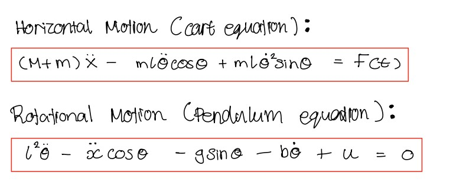
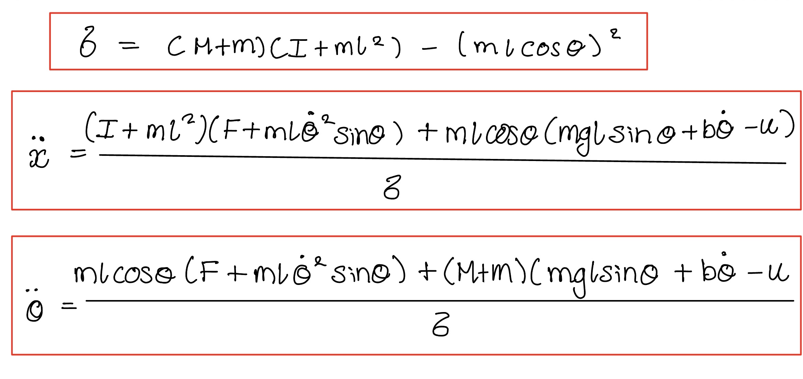

**Note:** this model has a single actuator. The applied horizontal force F is the only control input; there is no independent pivot torque. The motor's effect on the pendulum enters through the coupling term -mlẍcosθ rather than as a direct torque about the pivot. In the simulation code this input is named u.

# Equations of Motion

Derived from first principles using the Lagrangian method.

## Cart equation (horizontal motion)
(M+m)ẍ - mLθ̈cosθ + mLθ̇²sinθ = F(t)

## Pendulum equation (rotational motion)
(I+mL²)θ̈ - mLẍcosθ - mgLsinθ + bθ̇ = 0

Where:
- I = moment of inertia of the pendulum about its centre of mass (kg.m²)
- M = cart/wheel mass (kg)
- m = pendulum body mass (kg)
- L = distance from pivot to centre of mass (m)
- θ = angle from vertical (rad)
- F(t) = applied motor force (N)
- b = viscous damping coefficient (N.m.s/rad)

These are the full nonlinear coupled equations.
Stage 0 used a simplified single-body approximation as a first step.
These full coupled equations are implemented in Stage 1.

 

*Note: these images show the original hand derivation, which contained sign errors in the damping and centrifugal terms and incorrectly treated the control input as an independent pivot torque. The errors were identified through a dimensional consistency check and a physical sanity check on the open loop pole location, and propagated into the simulation code before correction. The equations above supersede the images.*

## Explicit form for simulation

The coupled equations above were solved simultaneously to eliminate the coupling terms and giving explicit expressions for both ẍ and θ̈ .

A shared denominator δ appears naturally from the algebra:

δ = (M+m)(I+mL²) − (mLcosθ)²

This represents the coupled inertia of the system. It varies with θ because the mechanical coupling between the cart and the pendulum changes with the angle.

ẍ = [(I+mL²)(F − mLθ̇²sinθ) + mLcosθ(mgLsinθ − bθ̇)] / δ

θ̈ = [mLcosθ(F − mLθ̇²sinθ) + (M+m)(mgLsinθ − bθ̇)] / δ

Where:
- δ = coupled inertia denominator
- I = moment of inertia (kg.m²)
- All other variables as defined above

Note: the full derivation separates cart force F and pendulum torque u as different inputs. In this implementation both are combined into a single control input u, as the motor drives both cart motion and pendulum correction through the same signal.