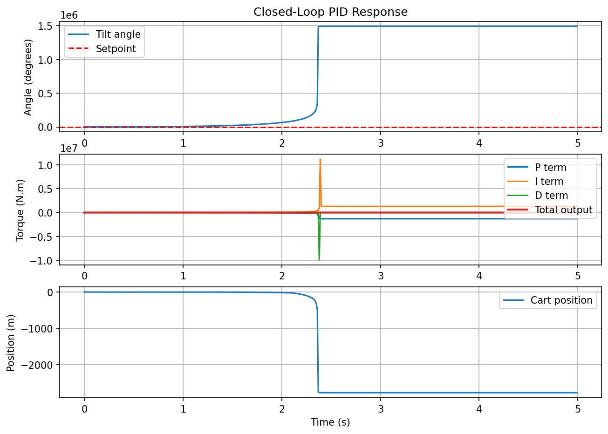

# Simulation Results - Stage 1

## Angle Only PID

With the full coupled cart-pole model implemented, the same angle-only PID from Stage 0 was tested. Unlike Stage 0 where cart motion was not modelled, the cart is now free to drift.

The system goes unstable — the angle explodes to 10⁶ degrees and the cart drifts to -2500m, essentially meaning both are heading to infinity — the pendulum has fallen.

This behaviour is expected since the PID controller is only controlling the angle and is not accounting for cart drift. This shows that a second PID is needed to control the cart's position.

## Cascaded PID — Before Analytical Tuning

To control both angle and cart position simultaneously, a cascaded PID structure was implemented. An outer position PID computes a target angle setpoint, which is fed into an inner angle PID that produces the motor torque. Gains were tuned manually.

The system is not fully stable. The angle, starting at 5 degrees, oscillates between approximately -1 and +1 degrees indefinitely. The cart position similarly oscillates between 0.12m and 0.22m after an initial transient. It is almost impossible to fully stabilise this way because correcting angle affects position and correcting position affects angle. This is because the two PIDs were designed independently without accounting for the mathematical coupling between cart and pendulum dynamics.

## Pole Placement Analysis

Before implementing state feedback, the open loop poles of the system were computed using the linearised A matrix from `plant.py`:

Open loop poles: [ 0, 0, 1.533, -3.200 ]

The positive pole (1.533) confirms the system is naturally unstable — the pendulum will fall without control. The two poles at zero correspond to the cart states, confirming the cart drifts indefinitely without correction.

Desired closed loop poles were chosen at [-3, -4, -5, -6] to give a stable, fast response without requiring unrealistic torque. The pole placement algorithm computed the required state feedback gain matrix:

K = [35.78, 4.26, 2.27, 2.14]

Where each value corresponds to the gain on θ, θ̇, x, and ẋ respectively.

## State Feedback Control — Pole Placement Result

Using the gain matrix K computed from pole placement, state feedback control was implemented in `simulate_state_feedback.py`. The control law replaces the entire cascaded PID with a single equation:

u = -(K[0]·θ + K[1]·θ̇ + K[2]·x + K[3]·ẋ)

All four states are used simultaneously to compute the torque, accounting for the coupling between cart and pendulum that the cascaded PID struggled with.

Using state feedback control stabilised the system. The angle starts at 5 degrees and converges to the setpoint within approximately 4 seconds. The torque also converges to zero, indicating that in ideal conditions no corrective force is needed to maintain the upright position. The cart position stabilises back at the origin after drifting a maximum of 0.2m — a significant improvement over the cascaded PID approach.