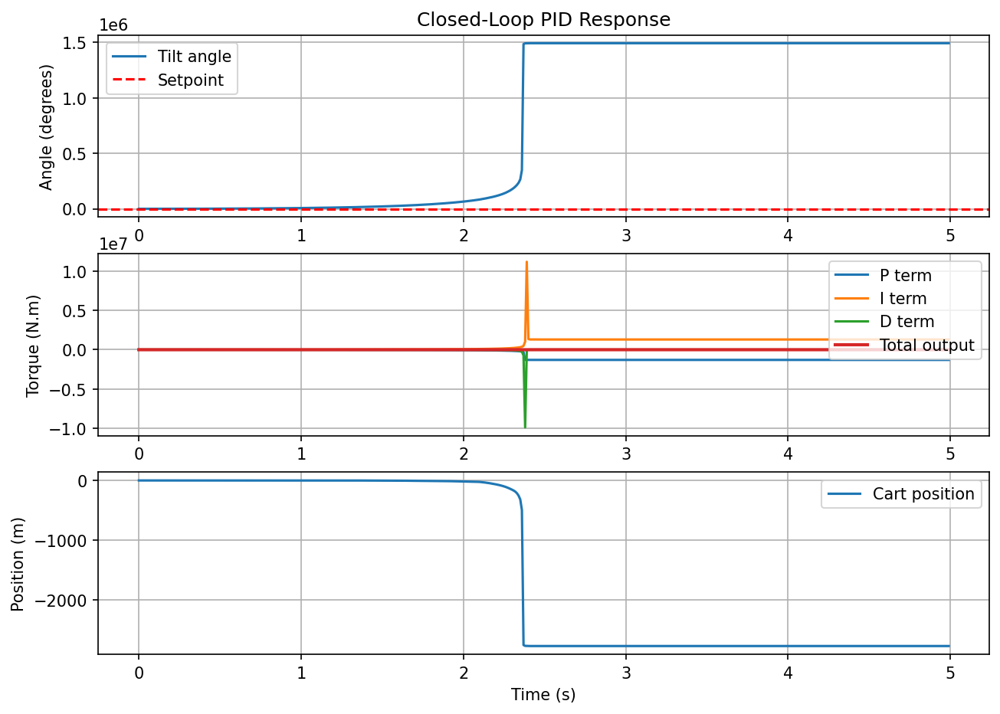

# Simulation Results - Stage 1

**Note on parameters:** The physical parameters used throughout Stage 1 - cart and pendulum mass, pendulum length, and the torque limit are nominal values chosen before hardware selection. They do not represent the measured properties of the robot being built. Open loop pole locations, gain values and settling times therefore describe the model rather than the physical system. Simulations will be re-run with measured parameters once characterisation is complete in Stage 2.

## Angle Only PID

With the full coupled cart-pole model implemented, the same angle-only PID from Stage 0 was tested. Unlike Stage 0 where cart motion was not modelled, the cart is now free to drift.

The system goes unstable - the angle explodes to 10⁶ degrees and the cart drifts to -2500m, essentially meaning both are heading to infinity - the pendulum has fallen.

This behaviour is expected since the PID controller is only controlling the angle and is not accounting for cart drift. This shows that a second PID is needed to control the cart's position.

## Cascaded PID - Before Analytical Tuning

To control both angle and cart position simultaneously, a cascaded PID structure was implemented. An outer position PID computes a target angle setpoint, which is fed into an inner angle PID that produces the control force. Gains were tuned manually.

The cascaded PID fails to regulate cart position. The angle settles at a constant 8.1 degrees with a constant control output of -2.1 N, while the cart accelerates away continuously, reaching -15.7m within 5 seconds. The system finds a runaway equilibrium where a constant tilt and constant force balance while the cart accelerates without bound. It is almost impossible to fully stabilise this way because correcting angle affects position and correcting position affects angle. This is because the two PIDs were designed independently without accounting for the mathematical coupling between cart and pendulum dynamics.

## Pole Placement Analysis

Before implementing state feedback, the open loop poles of the system were computed using the linearised A matrix from `plant.py`:

Open loop poles: [ 0, 0, 6.22, -7.89]

The positive pole (6.22) confirms the system is naturally unstable - the pendulum will fall without control. The two poles at zero correspond to the cart states, confirming the cart drifts indefinitely without correction.

Desired closed loop pole locations were arrived at iteratively. Poles must lie in the left half plane for stability, and were placed relative to the open loop unstable pole at 6.220. Successive sets were tested in simulation and evaluated on settling time and peak control force: poles placed further left converged faster but demanded more force. [-3, -4, -5, -6] was retained as the fastest response that stayed within a reasonable force budget.

The pole placement algorithm computed the required state feedback gain matrix:

K = [57.33, 8.15, -11.01, -10.83]

Where each value corresponds to the gain on θ, θ̇, x, and ẋ respectively.

## State Feedback Control - Pole Placement Result

Using the gain matrix K computed from pole placement, state feedback control was implemented in `simulate_state_feedback.py`. The control law replaces the entire cascaded PID with a single equation:

u = -(K[0]·θ + K[1]·θ̇ + K[2]·x + K[3]·ẋ)

All four states are used simultaneously to compute the control force, accounting for the coupling between cart and pendulum that the cascaded PID struggled with.

Using state feedback control stabilised the system. The angle starts at about 4.5 degrees, undershoots to -2.6 degrees, and converges to the setpoint within approximately 2.5 seconds. Peak control force is 5 N at the start of the correction, decaying to zero as the system settles. The cart moves a maximum of 0.08m from the origin before returning to it - a significant improvement over the cascaded PID, which failed to regulate position at all.