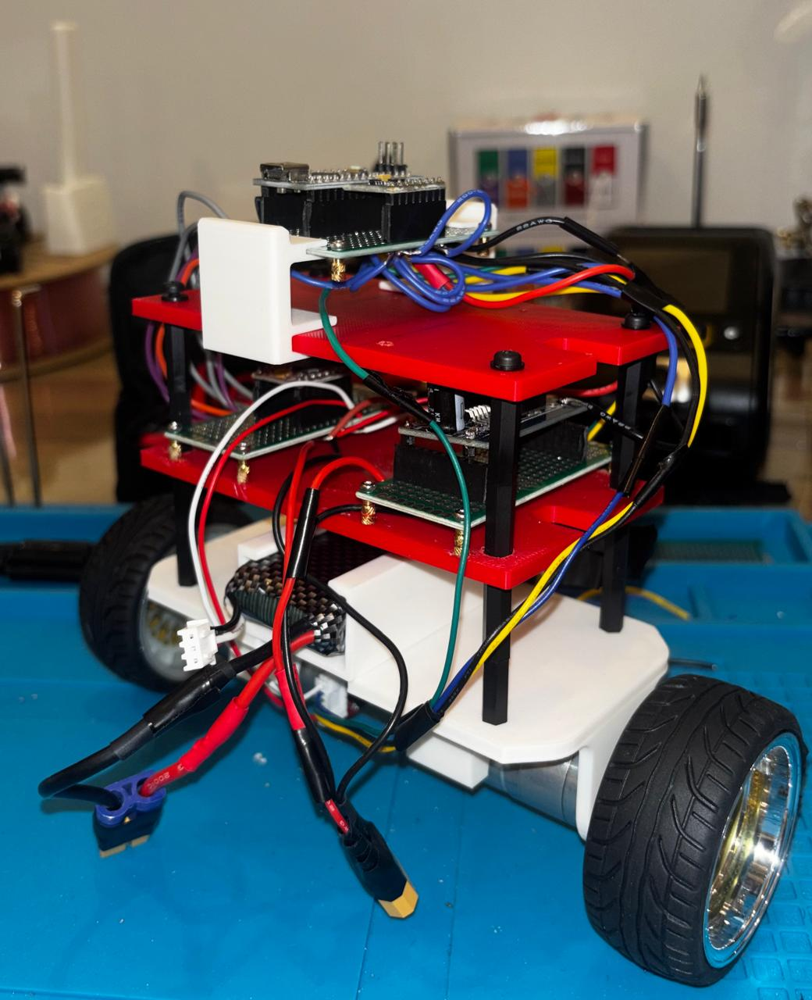
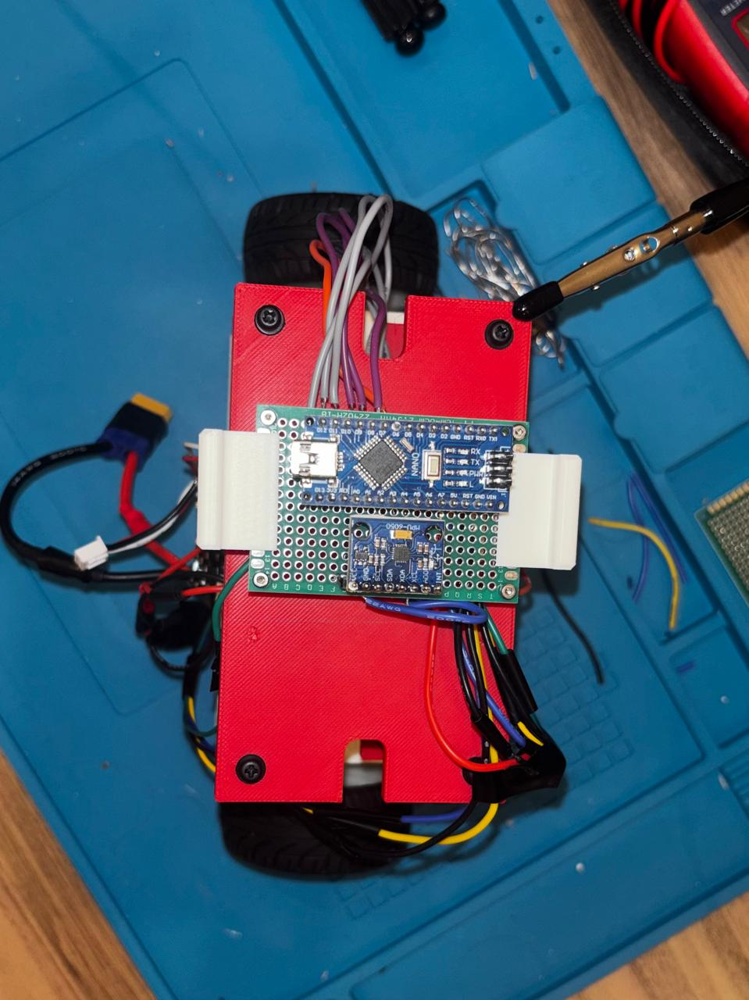
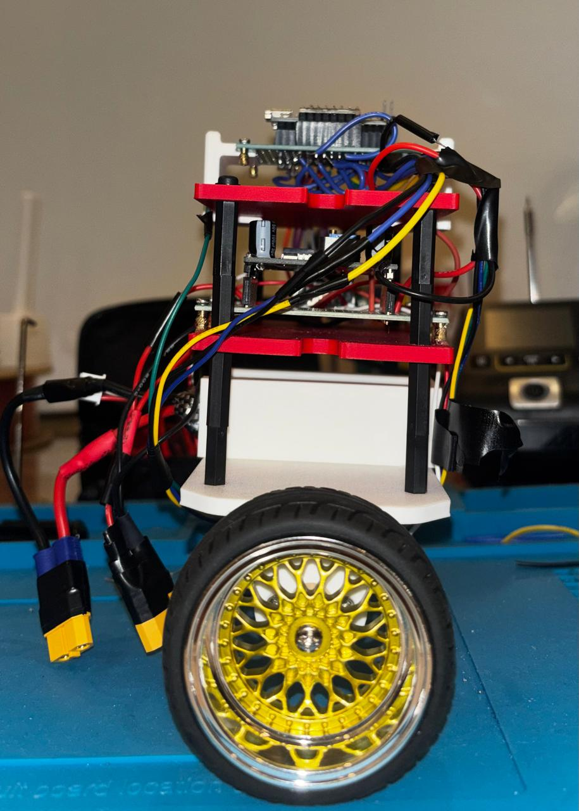

# Hardware Design - Stage 2

## Build

*Assembled robot — three-quarter, top and side views*

## Component Selection

| Component | Qty | Key spec | Why chosen |
|---|---|---|---|
|**LM2596** |**1** |**Not in final build - see why under 'Electronics''**, ||
|Arduino Nano |1 |ATmega328P chip, 16MHz, 5V |Small footprint, widley available |
|MPU6050 IMU |1 |6-axis (3axis accelerometer, 3axis gyroscope), I2C |Measures both acceleration and rotation rate|
|TB6612FNG Driver |1 |Dual-channel, 1.2A continuous - 3.2A peak, 2.5-13.5V motor supply |Lower voltage drop than common alternatives (Important with 7.2v battery)|
|JGA25-370 |2 |12V, 170RPM - no load, integrated encoder, 1.2-1.8 stall |Integrated quadrature encoders provide the wheel position and velocity states required for full state feedback |
|Wheels - 65mm Diameter |2 |Rubber, 65mm diameter |Rubber for traction|
|2S LiPo |1 |7.4V, 1600mAh |Voltage within drivers range |

## Mechanical Design
### Chassis Layout

The chasis is a three-platform stack. The bottom platform has motor mounting brackets built into it, holding the motors beneath it, with the battery carried ontop. The middle platform holds the motor driver and buck converter. The top platform carries the perfboard with the Arduino nano and IMU, mounted centrally.

The battery was originally intended to be on the middle platform in order to avoid lowering center of mass, however a decision was made to mount it into a printed bracket for removability. The bracket takes up more space than the battery alone so space was only found for it in the bottom platform, this works against the stacks layout intent of raising it but was accepted in exchange for a removable battery.

### Printed Parts

*CAD source files for the chassis were lost in a hardware issue and have not been recreated. Printed parts remain in use and physical parameters were measured from the build assembly*

**Bottom Platform.** Printed as a single piece with the motor mounting brackets included in the geometry rather than as separate bonded parts. The brackets locate the motors at the front of the body only.

**Motor rear supports.** The integral brackets hold the motors at one end, leaving the rear of each motor unsupported. Because the motors are back-heavy, this caused the rear ends to slack under their own weight. A support was printed for each motor with a semicircular cutout matching the motor barrel radius, bonded to both the platform and the motor body. This constrains the rear of the motor and eliminates the issue.

**Battery bracket.** A printed enclosure glued to the bottom platform, holding the LiPo. The front face is left open so the battery slides in and out, and the top face is reduced to narrow lips along each side, retaining the battery vertically while leaving most of the top open to reduce excessive friction.

**Perfboard clips.** The top perfboard is populated with wiring on its underside, so it cannot sit flush against the platform. Friction-fit clips were printed to engage both the platform and the perfboard, standing it off far enough to clear the wiring beneath. Using a friction fit rather than glue means the perfboard can be lifted off for access without breaking the mounting. 2 clips were added one on each side near the edge of the platform.

### Assembly
The three platforms are joined by nylon M3 standoffs at [X]mm spacing.

The middle perfboard is mounted using four small M3 standoffs, glued to the platform and passing through the 4 corner holes with a screw ontop of each. The top perfboard uses friction-fit clips instead, which was the later and better approach since it avoids the bonded joint and allows the board to be lifted off. However, omponents on both boards are socketed on headers rather than soldered directly, so they remain accessible for replacement regardless of how the board itself is mounted.

Motors are fastened into the integral brackets with screws.

## Electronics
### Power Architecture
An LM2596 buck converter originally supplied the 5V rail. It was removed. Taking VCC from the Nano's own 5V rail means the driver's logic supply and its logic signals always come from the same source; with a separate converter there is a state in which battery is disconnecte and USB is connected, where the Nano drives the driver's inputs while its VCC sits at 0V. Two motor drivers were lost before this was identified.

The 2S LiPo supplies two separate rails. Motor power is taken directly from thebattery to the TB6612FNG's VM input. The battery also feeds the Arduino Nano's VIN, whose onboard regulator produces the 5V rail supplying the MPU6050, the encoders, and the driver's logic input (VCC) — allowing one battery to fulfil both voltage requirements.

The rails are also separated because, motors need rapidly switching currents which causes noise. Sharing a supply between the motors and the sensor electronics would couple that switching noise into the IMU readings, which the control loop depends on.

All subsytems share a common ground. This is because the driver interprets the Nano logic reletive to its own ground reference, so in order to keep the logic consistent they must have the same reference point.

The IMU is mounted on the top platform, physically separated from the driver on the middle platform. The driver is a noise source, so distance between it and the sensor is a design choice.

### Wiring
#### Arduino Nano

| Pin | Connects to | Function |
|---|---|---|
| D2 | Motor A encoder channel A | Encoder input |
| D3 | Motor B encoder channel A | Encoder input |
| D4 | Motor A encoder channel B | Encoder input |
| D5 | Motor B encoder channel B | Encoder input |
| D6 | TB6612 STBY | Driver enable |
| D7 | TB6612 AIN1 | Motor A direction |
| D8 | TB6612 AIN2 | Motor A direction |
| D9 | TB6612 PWMA | Motor A speed |
| D10 | TB6612 PWMB | Motor B speed |
| D11 | MPU6050 INT | IMU interrupt |
| D12 | TB6612 BIN1 | Motor B direction |
| D13 | TB6612 BIN2 | Motor B direction |
| A4 | MPU6050 SDA | I2C data |
| A5 | MPU6050 SCL | I2C clock |
| D0, D1 | Reserved for USB serial | Not connected |

#### Power

| From | To | Wire |
|---|---|---|
| Battery + | TB6612 VM |
| Battery + | Buck IN+ |
| Battery - | Buck IN- |
| Buck OUT+ (5V) | TB6612 VCC |
| Buck OUT+ (5V) | Nano 5V pin |
| Buck OUT+ (5V) | Encoder VCC, both motors |
| Buck OUT+ (5V) | MPU6050 VCC |

#### Motor outputs

| TB6612 | Motor | Wire |
|---|---|---|
| AO1 | Motor A + |
| AO2 | Motor A - |
| BO1 | Motor B + |
| BO2 | Motor B - |

## Physical Parameters

| Parameter | Symbol | Assumed (Stage 1) | Measured | Method |
|---|---|---|---|---|
| Body mass | m | 0.50 kg | 0.565kg | Scale |
| Wheel mass | M | 0.30 kg | 0.056kg | Scale |
| Pivot to COM height | L | 0.10 m | 0.043 | moment balance |
| Body inertia about COM | I | 0.006 kgm² | 0.00082 kgm² | Compound pendulum, 20 swings |

[View Stage 3 results](../stage3/README.md)