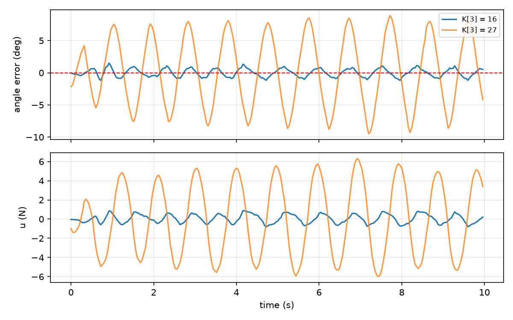

# Stage 3 — Embedded Implementation

Closing the loop on hardware. Bring-up constants, pin map and wiring are in Stage 2. This stage covers the actuator measurement that corrected the plant model, the recomputed gains, and the measured balancing performance.

Code was written with AI assistance for C and Arduino idiom. The control design, measurements, system identification and debugging are my own work.

## Actuator characterisation

The firmware converts force to duty as duty = u / U_MAX × 255. U_MAX is the scale factor between the newtons the controller computes and the PWM actually delivered, so an error in it multiplies every gain equally. It had been carried as a datasheet guess of 4.0 N, changed to 2.77 then later replaced by 11.1 N (see method below).

### Method

The robot was laid flat on a bottlecap used as a skid and driven from standstill at full duty, with distance logged from the encoders. Ten runs.

The step response of the drivetrain is first order. Fitting it across the full run gives v_max and τ, from which a₀ = v_max / τ. This is more reliable than measuring the initial slope by hand, where few samples and a small displacement leave the encoder noise dominating.

| Parameter | Fitted | Meaning |
|---|---|---|
| a₀ | 17.7 m/s² | Acceleration at t = 0, full force available |
| v_max | 0.43 m/s | Top speed, force decayed to zero |
| τ | 24 ms | Time constant of the decay |

```
U_MAX = m · a₀ = 0.625 × 17.7 ≈ 11.1 N
```

**`U_MAX` = 11.1 ± 0.13 N** over ten runs. Agreement ±1.2%, fits tracking the data to 0.12 mm RMS.


Friction was neglected. The full form is U_MAX = m·a₀ + F_friction, and friction only reduces observed acceleration, so 11.1 N is a lower bound. Skid friction puts the true figure near 12 N. The firmware uses 11.1 N, because the skid friction belongs to the test rig and is not present while balancing.

The fit also gives the drag. Force falling from 11.1 N at standstill to zero at 0.43 m/s is back-EMF acting as viscous damping, b_drive = m / τ ≈ 26 N·s/m. The Stage 1 plant treats u as a pure force, so this term was added to plant.py before the gains were recomputed.

## Control design

The measured b_drive was then set in plant.py, so the model includes the back-EMF drag the Stage 1 plant omitted. Stage 1 results were produced before this term existed and reflect the undamped model.

Motor force becomes F = u - b_drive · ẋ. That term enters both the ẍ and θ̈ rows of A, since they are coupled through the cart equation.

### Effect on the derived gains

Pole placement at [-15, -18, -0.7, -0.9], using the Stage 2 measured
parameters:

| | Without drag | With b_drive = 26 |
|---|---|---|
| K[0] | 13.703 | 13.703 |
| K[1] | 0.879 | 0.879 |
| K[2] | -0.405 | -0.405 |
| K[3] | -1.079 | -27.079 |

Only the velocity gain changes, and it changes by exactly 26.000. This is the expected result rather than a coincidence since F = u - b·ẋ.

### Firmware gains

```cpp
const float K[4] = { 13.703f, 0.879f, 0.405f, 16.000f };
```

K[0], K[1] and K[2] are used exactly as derived. K[3] was reduced experimentally from the derived 27.079 down to 16, which took steady-state angle from ±12° to ±1° and position wander from roughly 1 m to ±0.5 cm.

### Speed Scheduling

| Constant | Value |
|---|---|
| K3_FAST | 26.0 |
| V_BLEND | 0.15 m/s |

K[3] blends from 16 at standstill to 26 above V_BLEND. Recovery from a push is a force balance where the angle term has to beat the residual motor drag with the wheels already moving. One fixed gain cannot be both calm at standstill and authoritative during a recovery.

V_BLEND = 0.15 m/s was found by experiment. Raising it to 0.5 causes loss of balance, while disabling the schedule entirely does not, so the constant is not a simple threshold that can be relaxed. An intermediate blend appears to be worse than either endpoint, which suggests the issue is the rate at which k3 tracks velocity rather than the threshold itself. This has not been investigated further.


### Sign inversion

The simulation and the robot use opposite θ conventions, so K[2] and K[3] are sign-flipped between the two. K[0] and [1] are not. The firmware therefore applies +u where the simulation uses u = -Kx.

This was found late. The outer loop had been running inverted through earlier development before the discrepancy was traced.

## Firmware constants

Everything the control law depends on that is not a gain.

| Constant | Value |
|---|---|
| THETA_OFFSET | 0.0365 rad |
| DEADBAND_L | 19 |
| DEADBAND_R | 12 |
| GYRO_LPF | 0.15 |
| VEL_LPF | 0.15 |
| TAU | 0.5 s |
| Loop rate | 200 Hz |

THETA_OFFSET is the mean theta from a logged balanced run rather than a static measurement. Rolling resistance makes the apparent balance point direction-dependent, so a value taken from one direction alone is biased.

TAU is the complementary filter time constant. Neither sensor gives the angle alone, since the gyro is smooth but drifts as its bias integrates, while the accelerometer knows true vertical but reads motor vibration as tilt. TAU sets the split between them, trading noise against drift.A consequence is that a residual gyro bias of delta produces a steady angle error of delta multiplied by TAU. At 0.5 s, a bias error of 1 deg/s becomes half a degree of standing error, which is why the calibration value is checked at every boot.

GYRO_LPF smooths the rate term, separate from the complementary filter. The controller uses gyro rate directly for damping, and the raw signal is noisy enough that K[1] amplifies it into audible chatter. Each cycle the filtered value moves 15% toward the new reading, so noise averages out while real changes still come through. The cost is phase lag, which weakens the damping and is one candidate for the residual oscillation. Set by hand, smoothed only as far as the chatter required.

## Logging

Runs are captured untethered to stop the connected wire from effecting the run, so the log cannot be streamed over serial.

Samples are written to a RAM buffer placed in a .noinit section, which is not cleared by the warm reset that occurs when the serial port is opened. The robot runs free, is picked up and plugged in, and the buffer is dumped on the next boot.

The buffer holds 10 seconds at 25 Hz, recording e and u as int16. Every figure below came from these logs.

## Results

### Steady State Balancing


The robot balances indefinitely, holding within ±2.0 degrees of the balance point with an RMS of 0.94 degrees. Control effort peaks at 1.74 N against 11.1 N available, under 16% of actuator authority.

Control effort stays within ±1.2 N against 11.1 N available, under 11% of actuator authority. Force is not the constraint.

Three candidate mechanisms were tested and eliminated. Raising U_MIN across three values changed nothing, ruling out the low-force deadband. Increasing GYRO_LPF from 0.15 to 0.3 made the oscillation slightly larger rather than smaller, ruling out filter phase lag. The force headroom above rules out saturation.

That leaves gearbox backlash, measured at roughly 2.5 degrees, which is the same order as the oscillation amplitude. A correction must cross the gear slop before reaching the wheels, so it arrives late and overshoots. This is a mechanical limit rather than a control one, and no gain or filter setting removes it.

### Steady State Comparison for Velocity Gains



Raising K[3] from 16 to 27 increases angle RMS from 0.62 to 5.38 degrees and control effort from 0.45 to 3.78 N RMS. Both scale by roughly the same factor, and even at 27 the effort stays within a third of the 11.1 N available, so the degradation is not a force limit.

### Push Test


Both runs use identical gains and differ only in whether the velocity gain is scheduled. With scheduling disabled the robot fails to recover from a 2.2 degree tap at 5.7 s and falls. With scheduling enabled it recovers from three disturbances, the largest reaching 9.4 degrees, returning to the setpoint within about 1.5 s each time.

The control effort traces show the mechanism. Without scheduling the commanded force stays near 2 N through the second after the tap, which is not enough to run the wheels out under the falling body. It only exceeds 11.1 N once the robot is already past recovery, and that command is beyond what the actuator can deliver. With scheduling, K[3] blends up as the wheels accelerate, and the controller commits 8.5 N at the moment of the disturbance rather than after it.

## Where this leaves the build

## Where this leaves the build

The robot balances indefinitely and recovers from disturbances up to roughly 9 degrees. The residual limit cycle of ±0.7 degrees is mechanical rather than a control problem, and removing gearbox backlash is the only change likely to reduce it.

Three of four gains are used exactly as derived from the model. The velocity gain is the exception, reduced from 27 to 16 for steady-state behaviour and scheduled back up above 0.15 m/s for recovery.

Stage 4 compares logged runs against the simulation directly, using release tests from a known initial angle so both sides start from the same condition.

[View Stage 4 results](../stage4/README.md)